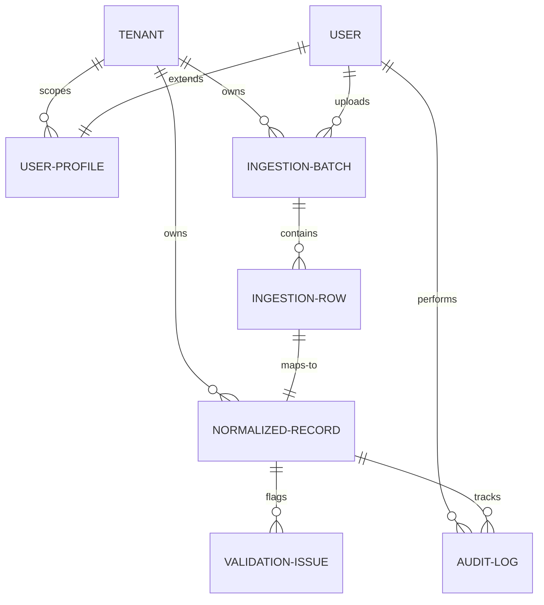

# Breathe ESG Data Platform - Database Model Schema (MODEL.md)

This document defines the database model schema for the Breathe ESG Data Platform. It details the relational database design, the multi-tenancy implementation, unit normalization strategy, audit trails, and the analyst review workflow.

---

## 1. Entity List

The platform consists of seven core relational entities:

1. **Tenant**: Root entity representing the enterprise client organization.
2. **UserProfile**: Extension of the authenticated user to associate credentials with a specific tenant and define access roles.
3. **IngestionBatch**: Metadata container storing details and the exact raw text of an uploaded CSV file.
4. **IngestionRow**: Line-by-line storage of parsed CSV records in raw JSON format to maintain a permanent link to source data.
5. **NormalizedRecord**: Canonical accounting record containing mapped categories, normalized quantities, standard units, and calculated carbon footprints ($kg\ CO_2e$).
6. **ValidationIssue**: Automation-detected data quality flags, warnings, or errors associated with a specific normalized record.
7. **AuditLog**: Immutable historical record of edits, capture of previous/new value differences, and mandatory justification logs.

---

## 2. Entity Relationship Diagram

The following Mermaid diagram outlines the relationships and cardinalities between the tables:



---

## 3. Table Definitions

### A. Tenant
Represents the root boundary for data isolation.

| Field Name | Data Type | Constraints | Description |
| :--- | :--- | :--- | :--- |
| `id` | BigAutoField | Primary Key, Auto-increment | Internal unique database key. |
| `name` | CharField(255) | Unique, Not Null | The enterprise company name. |
| `created_at` | DateTimeField | Auto-now-add, Not Null | Timestamp of registration. |

### B. UserProfile
Extends the native Django user system to bind credentials to a Tenant boundary and role.

| Field Name | Data Type | Constraints | Description |
| :--- | :--- | :--- | :--- |
| `id` | BigAutoField | Primary Key, Auto-increment | Internal unique database key. |
| `user` | OneToOneField | Unique, Not Null, FK (auth.User), Cascade | Reference to user credentials. |
| `tenant` | ForeignKey | Not Null, FK (Tenant), Restrict | isolated organization association. |
| `role` | CharField(10) | Not Null, Choices: `ANALYST`, `ADMIN` | Permissions role. |

### C. IngestionBatch
Tracks the metadata of the ingested CSV files.

| Field Name | Data Type | Constraints | Description |
| :--- | :--- | :--- | :--- |
| `id` | UUIDField | Primary Key, Default: uuid4 | Unique batch transaction ID. |
| `tenant` | ForeignKey | Not Null, FK (Tenant), Cascade | Organization owning this upload batch. |
| `source_type` | CharField(10) | Not Null, Choices: `SAP`, `UTILITY`, `TRAVEL` | Parser type utilized for mapping. |
| `file_name` | CharField(255) | Not Null | Original filename uploaded. |
| `raw_content` | TextField | Not Null | Complete raw text payload of the CSV file. |
| `uploaded_by` | ForeignKey | Nullable, FK (auth.User), Set Null | User who initiated the upload. |
| `uploaded_at` | DateTimeField | Auto-now-add, Not Null | Timestamp of file upload. |

### D. IngestionRow
Stores the individual lines parsed from the raw CSV string.

| Field Name | Data Type | Constraints | Description |
| :--- | :--- | :--- | :--- |
| `id` | BigAutoField | Primary Key, Auto-increment | Internal unique database key. |
| `batch` | ForeignKey | Not Null, FK (IngestionBatch), Cascade | Parent upload batch identifier. |
| `row_index` | IntegerField | Not Null | Line number of the row in the source file. |
| `raw_data` | JSONField | Not Null | Key-value pairs of raw CSV header-to-column data. |
| `status` | CharField(15) | Choices: `PENDING`, `NORMALIZED`, `FLAGGED` | Pipeline state of this individual row. |

### E. NormalizedRecord
The standardized ESG record format.

| Field Name | Data Type | Constraints | Description |
| :--- | :--- | :--- | :--- |
| `id` | UUIDField | Primary Key, Default: uuid4 | Unique canonical record transaction ID. |
| `tenant` | ForeignKey | Not Null, FK (Tenant), Cascade | Isolated owner of this record. |
| `source_row` | OneToOneField | Nullable, FK (IngestionRow), Set Null | Pointer to the raw row that created this log. |
| `scope` | IntegerField | Not Null, Choices: `1`, `2`, `3` | Greenhouse Gas Scope categorization. |
| `category` | CharField(50) | Not Null | High-level bucket (e.g., `FUEL_COMBUSTION`, `ELECTRICITY`). |
| `activity_type` | CharField(50) | Not Null | Subtype classification (e.g., `DIESEL`, `GRID_ELECTRICITY`). |
| `quantity` | DecimalField | Max digits: 18, places: 6, Not Null | Numeric usage value. |
| `normalized_unit` | CharField(20) | Not Null | Target system unit used for factor calculations. |
| `source_unit` | CharField(20) | Not Null | Raw input unit provided during upload. |
| `date` | DateField | Not Null | Billing period end or transaction posting date. |
| `confidence` | DecimalField | Max digits: 3, places: 2, Default: 1.00 | Data reliability index (0.00 to 1.00). |
| `co2e_emissions` | DecimalField | Max digits: 18, places: 6, Nullable | Calculated footprint ($kg\ CO_2e$). |
| `status` | CharField(15) | Choices: `PENDING`, `NORMALIZED`, `FLAGGED`, `APPROVED` | Record workflow lifecycle state. |
| `created_at` | DateTimeField | Auto-now-add, Not Null | Timestamp of record creation. |
| `updated_at` | DateTimeField | Auto-now, Not Null | Timestamp of last modification. |

### F. ValidationIssue
Stores active automated data-quality diagnostics.

| Field Name | Data Type | Constraints | Description |
| :--- | :--- | :--- | :--- |
| `id` | BigAutoField | Primary Key, Auto-increment | Internal unique database key. |
| `record` | ForeignKey | Not Null, FK (NormalizedRecord), Cascade | Link to the flagged normalized record. |
| `rule_name` | CharField(50) | Not Null | Key identifier of the failed rule. |
| `message` | TextField | Not Null | Context message explaining the rule violation. |
| `severity` | CharField(10) | Not Null, Choices: `ERROR`, `WARNING` | Errors flag status; warnings allow approval. |
| `detected_at` | DateTimeField | Auto-now-add, Not Null | Timestamp when the flag was generated. |

### G. AuditLog
Enforces analyst accountability.

| Field Name | Data Type | Constraints | Description |
| :--- | :--- | :--- | :--- |
| `id` | BigAutoField | Primary Key, Auto-increment | Internal unique database key. |
| `record` | ForeignKey | Not Null, FK (NormalizedRecord), Cascade | Reference to the updated record. |
| `changed_by` | ForeignKey | Nullable, FK (auth.User), Set Null | User who authorized the modification. |
| `timestamp` | DateTimeField | Auto-now-add, Not Null | Date and time the change was committed. |
| `reason` | TextField | Not Null | Analyst justification text for overriding the field. |
| `old_values` | JSONField | Not Null | Key-value mapping of fields before modification. |
| `new_values` | JSONField | Not Null | Key-value mapping of fields after modification. |

---

## 4. Relationships & Constraints

* **Tenant Isolation**: Foreign key links (`tenant_id`) exist on `UserProfile`, `IngestionBatch`, and `NormalizedRecord`. Standard database indexes will be created on these columns to guarantee query performance.
* **Cascade Deletes**:
  * Deleting a `Tenant` cascades and deletes associated user profiles, ingestion batches, and normalized records.
  * Deleting a `NormalizedRecord` cascades and deletes associated `ValidationIssue` entries and `AuditLog` rows.
* **Restricted Deletes**: Deleting a `Tenant` is blocked if active approved ledger data exists.
* **UUID Isolation**: Primary keys for `IngestionBatch` and `NormalizedRecord` use UUID4 to prevent sequential ID guessing (enumeration attacks).

---

## 5. Multi-Tenancy Strategy

The database uses a **logical isolation model** where all tenants share the same tables, but every sensitive query is scoped to the tenant of the requesting user.

* **Database Level**: A `tenant_id` foreign key resides on all primary data entities.
* **Application Level**: A Custom Django QuerySet and Model Manager intercepts operations. Views retrieve datasets using `NormalizedRecord.objects.scoped(request.user)`, which appends `filter(tenant=request.user.profile.tenant)` automatically. This prevents developer oversights from causing data leakage.
* **Admin Privilege Bypass**: Users possessing `role = ADMIN` bypass automated scoping in dashboard reporting views to review global data sets if configured.

---

## 6. Source Tracking

To satisfy auditor traceability, each canonical `NormalizedRecord` is linked to its exact point of origin:
1. **Source Batch**: Relates back to the parent `IngestionBatch` metadata (filename, upload timestamp, author).
2. **Source Row**: Connected via `source_row` ForeignKey to the parsed JSON representation in `IngestionRow`.
3. **Raw String File**: The `raw_content` column in `IngestionBatch` holds the unaltered original file text.

---

## 7. Scope 1/2/3 Handling

GHG Scopes are represented as integers (1, 2, 3) for efficient query indexing.
* **Scope 1 (Direct Fuel)**: Activity types classified under SAP accounts designated for fuels (e.g. `DIESEL`, `HEATING_OIL`).
* **Scope 2 (Indirect Electricity)**: Mapped from Utility exports, targeting the `ELECTRICITY` category.
* **Scope 3 (Value Chain - Travel)**: Mapped from Travel booking files, targeting flights (`FLIGHT`) and hotel nights (`HOTEL`).

---

## 8. Audit Trail Architecture

The audit trail is implemented directly in the database schema.
* **Justification Enforcement**: The `AuditLog` table contains a non-nullable `reason` text field. The application layer forces validation checks to confirm this field contains text before saving overrides.
* **Diff Tracking**: Rather than saving full duplicate copies of records, only modified fields are captured.
* **State Verification**: Django's serializer update pipeline inspects the record status. If a record has a status of `APPROVED`, database write operations are blocked.

---

## 9. Normalization Strategy

* **Source Unit Ingestion**: Retained inside `source_unit` to preserve transparency.
* **Target Unit Standardization**: Converted quantities are saved into `quantity` alongside `normalized_unit` (e.g. gallons/liters to `LITER`, miles/km to `KM`, utility units to `KWH`).
* **Static Emission Coefficients**: Standard factors are applied at normalization:
  * Diesel: $2.68\ kg\ CO_2e\ /\ liter$
  * Grid Electricity: $0.38\ kg\ CO_2e\ /\ kWh$
  * Flight: $0.12\ kg\ CO_2e\ /\ km$
  * Hotel Night: $15.00\ kg\ CO_2e\ /\ room\_night$

---

## 10. Review Workflow State Machine

```
      +------------------+
      |     PENDING      |
      +--------+---------+
               |
               v (Automated Parse/Validation)
       ________/\________
      /                  \
     /                    \
    v (Issues Detected)    v (Zero Issues)
+--------+---------+  +--------+---------+
|    FLAGGED       |  |   NORMALIZED    |
+--------+---------+  +--------+---------+
         |                     |
         | (Analyst Edit/Reason)|
         +-------->------------+
                               |
                               v (Analyst Sign-off)
                        +--------+---------+
                        |    APPROVED      |  <-- LOCKED (Write Blocked)
                        +------------------+
```

---

## 11. Example Records

### IngestionRow (SAP Fuel Row #1)
```json
{
  "id": 4012,
  "batch_id": "8a7c29fb-b83c-41ef-ba38-1ee4db75c90d",
  "row_index": 1,
  "raw_data": {
    "TransactionID": "SAP-TXN-9021",
    "PostingDate": "2026-01-10",
    "GLAccount": "600100",
    "Description": "DIESEL FOR PLANT GENERATORS",
    "Quantity": "500",
    "Unit": "L"
  },
  "status": "FLAGGED"
}
```

### NormalizedRecord (Scope 1 - Diesel)
```json
{
  "id": "e98e4f1a-b620-4ea2-9988-bb324efdc2c1",
  "tenant_id": 1,
  "source_row_id": 4012,
  "scope": 1,
  "category": "FUEL_COMBUSTION",
  "activity_type": "DIESEL",
  "quantity": 500.000000,
  "normalized_unit": "LITER",
  "source_unit": "L",
  "date": "2026-01-10",
  "confidence": 0.95,
  "co2e_emissions": 1340.000000,
  "status": "FLAGGED",
  "created_at": "2026-05-25T16:25:00Z"
}
```

### ValidationIssue (Suspicious Quantity Warning)
```json
{
  "id": 901,
  "record_id": "e98e4f1a-b620-4ea2-9988-bb324efdc2c1",
  "rule_name": "SUSPICIOUS_SPIKE",
  "message": "Calculated emissions (1340 kg CO2e) exceed 10x the tenant's historical median (100 kg CO2e) for DIESEL.",
  "severity": "WARNING"
}
```

### AuditLog (Analyst Correction)
```json
{
  "id": 78,
  "record_id": "e98e4f1a-b620-4ea2-9988-bb324efdc2c1",
  "changed_by": 2,
  "timestamp": "2026-05-25T16:28:00Z",
  "reason": "Corrected typing mistake; quantity was 50 liters instead of 500 liters.",
  "old_values": {
    "quantity": 500.000000,
    "co2e_emissions": 1340.000000,
    "status": "FLAGGED"
  },
  "new_values": {
    "quantity": 50.000000,
    "co2e_emissions": 134.000000,
    "status": "NORMALIZED"
  }
}
```

---

## 12. Why Each Table Exists

* **Tenant**: Necessary to isolate corporate organizational structures. Ensures we can serve multiple companies securely on a single logical stack.
* **UserProfile**: Links permissions and roles to standard users and restricts analysts from accessing data outside their designated tenant.
* **IngestionBatch**: Exists to group transaction files together, archiving the raw uploaded text format. Provides auditors with a verifiable origin block for historical re-evaluation.
* **IngestionRow**: Separates file parsing from carbon footprint normalization. By keeping the exact raw CSV columns unchanged in a database row, auditors can confirm that ingestion did not lose or alter information prior to normalization.
* **NormalizedRecord**: The core ledger table of the application. It acts as the single source of truth for carbon calculations and dashboards, representing heterogeneous data under one unified schema.
* **ValidationIssue**: Separates transient parsing alerts and warnings from the record itself. Enables users to view dynamic, multi-factor errors on a row without polluting core ledger columns.
* **AuditLog**: Crucial for regulatory compliance. It ensures all human corrections and adjustments are permanently recorded, providing third-party auditors with a complete history of the data.
