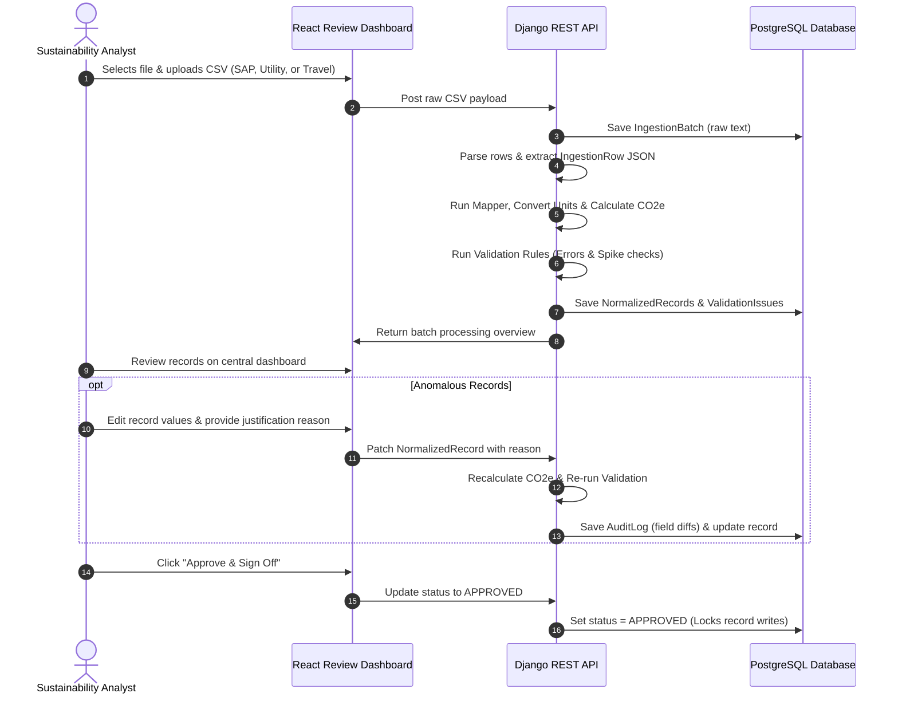
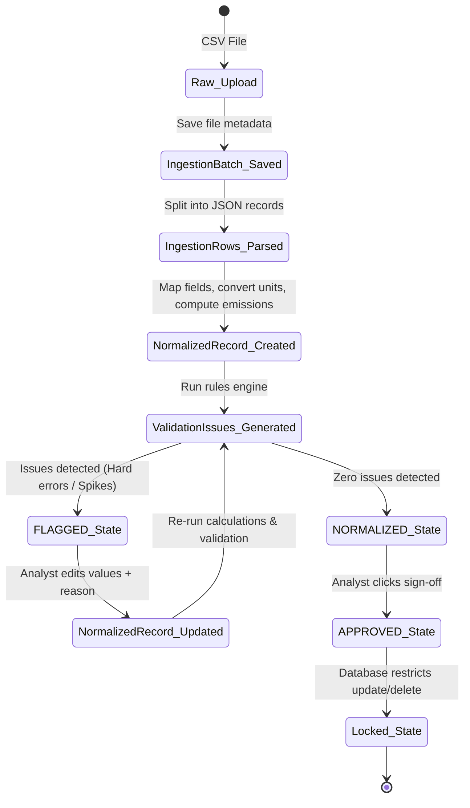

# Breathe ESG Data Platform - Project Specification (PROJECT_SPEC.md)

This document defines the technical design, requirements, and execution parameters for the Breathe ESG Data Platform prototype.

---

## 1. Final Scope of MVP (What WILL be built)

The MVP is a production-grade prototype built in Django REST Framework and React, designed to handle multi-tenant data ingestion, normalization, and auditing over a 4-day timeline.

* **Multi-Tenant Account Boundary**: System-enforced isolation of data. Users are linked to a single Tenant via their Profile, and data queries are automatically scoped to that Tenant.
* **Three-Source CSV Ingestion Engine**: REST endpoints accepting CSV uploads representing SAP (fuel/procurement), Utility (electricity), and Travel (flights/hotels) exports.
* **Canonical Mapping & Normalization Engine**: Services that map system-specific columns to standard target variables, perform unit conversions, and calculate CO2e emissions using static EPA/DEFRA factors.
* **Automated Data Quality Rules**:
  * **Hard Errors**: Triggers when records contain negative consumption, missing dates, or unmapped units.
  * **Spike Detection Warnings**: Triggers when a record's quantity exceeds 10x the median of historical approved records for the same category (requires $\ge$ 3 historical records; falls back to normal checks otherwise).
* **Analyst Review Dashboard (React)**:
  * Central dashboard displaying normalized records, filtered by status, source, and scope.
  * Detail panel showing the original raw CSV row data, active validation errors, and audit history.
  * Edit modal requiring a mandatory override justification text for any value or state changes.
* **Immutable Audit Trail**:
  * Persistent records of every field-level change, old/new diffs, analyst ID, and reason.
  * Structural locking mechanism that prevents any writes or overrides to a record once its status becomes `APPROVED`.

---

## 2. Explicit Exclusions (What WILL NOT be built)

To ensure delivery within the 4-day schedule, the following features are explicitly out of scope:

* **Physical Database/Schema Isolation**: We will use logical isolation (tenant-scoped keys in a shared schema).
* **Object Storage Integration**: Raw CSV content will be archived directly in PostgreSQL text fields, bypassing AWS S3/Azure Blob.
* **Asynchronous Processing (Celery/Redis)**: CSV processing runs synchronously during the request cycle. Uploads are expected to be limited in file size ($\le 1,000$ lines).
* **Direct Integration APIs**: No active API connections or polling agents to SAP, Concur, or utility portals. Ingestion is strictly file-upload based.
* **Dynamic Factor Configuration UI**: Emission factors are maintained in application code and static configurations; no management screen will be built for factor administration.
* **Advanced Carbon Metrics**: Water footprint, waste-to-landfill, and employee commuting scope metrics are excluded.

---

## 3. Selected Ingestion Formats

### SAP ERP Export (Fuel & Procurement)
* **Mode**: Manual CSV Upload
* **Expected Schema**:
  ```csv
  TransactionID,PostingDate,GLAccount,Description,Quantity,Unit
  TXN-SAP-001,2026-01-15,600100,DIESEL VEHICLE FLEET,500,L
  ```
* **Processing logic**: Scans the `Description` for keywords (`DIESEL`, `OIL`, `FUEL`) to identify the activity type, maps to Scope 1, and normalizes volume to Liters.

### Utility Portal Export (Electricity)
* **Mode**: Manual CSV Upload
* **Expected Schema**:
  ```csv
  AccountNumber,BillingPeriodStart,BillingPeriodEnd,Usage_kWh
  UTIL-ELEC-992,2026-01-01,2026-01-31,12500
  ```
* **Processing logic**: Maps consumption to Scope 2, sets the billing period end date as the canonical transaction date, and normalizes usage to kWh.

### Corporate Travel Platform Export (Flights & Hotels)
* **Mode**: Manual CSV Upload
* **Expected Schema**:
  ```csv
  BookingID,TravelDate,Mode,Distance_miles,HotelNights,SupplierName
  TRV-88219,2026-02-10,Flight,1200,,Delta Airlines
  TRV-88220,2026-02-12,Hotel,,3,Hilton Corporate
  ```
* **Processing logic**: Evaluates the `Mode` column. Flights calculate distance (miles normalized to kilometers for Scope 3 emissions). Hotels calculate room-nights (normalized to Room-Nights for Scope 3 emissions).

---

## 4. User Flow



---

## 5. Pages/Screens

1. **Upload Portal**:
   * File drop zone with source-type dropdown (`SAP`, `Utility`, `Travel`).
   * Upload progress indicator and validation preview (number of rows parsed vs. flagged).
2. **Review Dashboard**:
   * Summary metric cards: Total CO2e (kg), Pending Approval, Flagged Issues.
   * Central filter bar: Scope (1, 2, 3), Ingestion Source, Date Range, Status (`FLAGGED`, `NORMALIZED`, `APPROVED`).
   * Data table with columns: Ingestion Batch, Date, Category, Quantity, Standard Unit, CO2e, and Status.
3. **Analyst Review Drawer**:
   * Slides in on table row click.
   * Displays the original raw CSV columns side-by-side with normalized data.
   * Lists active validation issues (severity, error code, message).
   * Displays an edit form. Modifying values requires inputting text in the "Justification Reason" field.
   * Lists the historical audit logs for the row.

---

## 6. Data Lifecycle



---

## 7. Final Entity List

1. **Tenant**: Stores organization boundaries (`id`, `name`, `created_at`).
2. **UserProfile**: Connects user credentials to tenant and sets role access permissions (`User` reference, `Tenant` FK, `role`: `ANALYST` or `ADMIN`).
3. **IngestionBatch**: Archives the uploaded file (`id`, `Tenant` FK, `source_type`, `file_name`, `raw_content` text, `uploaded_by`, `uploaded_at`).
4. **IngestionRow**: Isolates raw CSV rows (`id`, `IngestionBatch` FK, `row_index`, `raw_data` JSON, `status`).
5. **NormalizedRecord**: Canonical accounting log (`id`, `Tenant` FK, `source_row` FK, `scope`, `category`, `activity_type`, `quantity`, `normalized_unit`, `source_unit`, `date`, `confidence`, `co2e_emissions`, `status`, `created_at`, `updated_at`).
6. **ValidationIssue**: Diagnostic flags (`id`, `NormalizedRecord` FK, `rule_name`, `message`, `severity`: `ERROR`/`WARNING`, `detected_at`).
7. **AuditLog**: Immutability logger (`id`, `NormalizedRecord` FK, `changed_by` User FK, `timestamp`, `reason` text, `old_values` JSON, `new_values` JSON).

---

## 8. Status Transitions

| Starting Status | Trigger Action | Target Status | Rules & Constraints |
| :--- | :--- | :--- | :--- |
| **`PENDING`** | File normalization completes with errors or warnings. | **`FLAGGED`** | Automated transition. System generates active `ValidationIssue` items. |
| **`PENDING`** | File normalization completes with zero validation alerts. | **`NORMALIZED`** | Automated transition. |
| **`FLAGGED`** | Analyst edits values. Edits resolve all validation errors. | **`NORMALIZED`** | System recalculates values and removes resolved errors/warnings. |
| **`NORMALIZED`** | Analyst clicks "Sign Off". | **`APPROVED`** | Transition allowed. System locks the record. |
| **`APPROVED`** | Any update/delete request. | **`APPROVED`** | **BLOCKED**. Database constraints and service layer validation throw `PermissionDenied` errors. |

---

## 9. Deployment Plan

* **Hosting Platforms**:
  * **Backend & Database**: Render (Web Service instance + managed PostgreSQL database).
  * **Frontend**: Render Static Site (Vite React application built and deployed to CDN).
* **Database Setup**: Initialized via Django migrations. Standard indexes placed on:
  * `NormalizedRecord` (`tenant_id`, `status`, `date`).
  * `AuditLog` (`record_id`).
* **Environment Variables**:
  * `DATABASE_URL` (Postgres connection URI).
  * `DJANGO_SETTINGS_MODULE` (Production settings selector).
  * `CORS_ALLOWED_ORIGINS` (Vite client URL address).
  * `SECRET_KEY` (Django security key).

---

## 10. Assumptions

* **File Volume Constraints**: Ingested files contain $\le 1,000$ rows, eliminating the need for Celery asynchronous processing.
* **Pre-Standardized Units**: Ingested CSV files use units recognized by the mapping module (e.g. L, Litres, kWh, miles, nights). Unrecognized units trigger validation errors.
* **Timezone Consistency**: Dates inside CSV files represent the local tenant timezone; the system stores these as UTC.
* **Bootstrap Thresholds**: Historical spike detection becomes active once a tenant has at least 3 approved records in that category. If fewer than 3 approved records exist, warning flags for spikes are skipped.

---

## 11. Risks

* **Spike Engine Warm-up (Cold Start)**: New tenants will not have historical data to calculate median thresholds, potentially missing initial spikes.
  * *Mitigation*: Fall back to standard static rules (e.g. flagging extreme outliers like $\ge 1,000,000$ usage units) until 3 historical approved records are logged.
* **Cross-Tenant Data Leakage**: Inadvertent data exposure if developers forget to filter queries by tenant.
  * *Mitigation*: Strictly apply the `TenantScopedQuerySet` at the model level to automatically filter database operations by default.
* **Regulatory Calculation Drift**: Adjustments to EPA/DEFRA conversion factors over time.
  * *Mitigation*: Store calculated emissions eagerly inside `co2e_emissions` during ingestion. Regulators' changes do not update existing stored metrics retrospectively.
