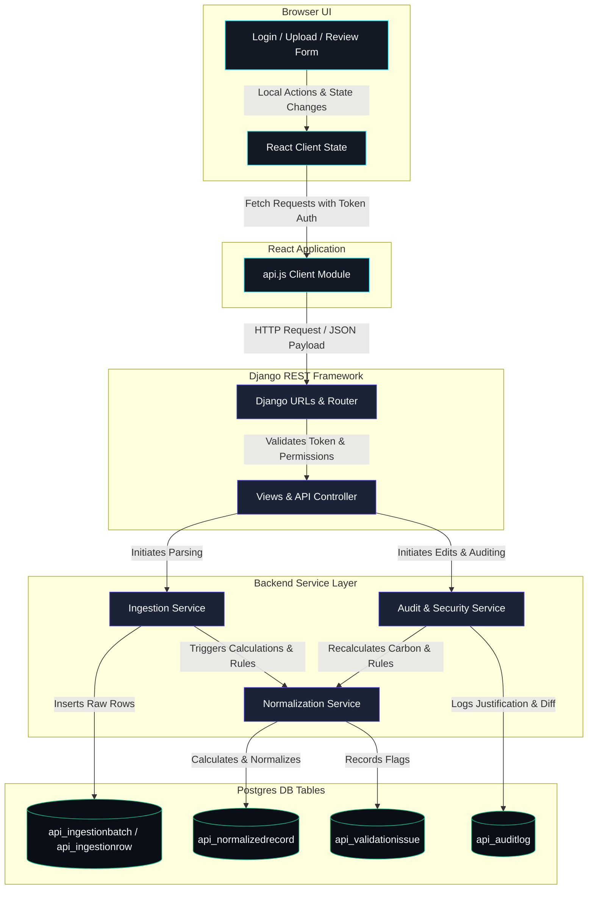

# Breathe ESG Data Platform - Comprehensive Project Understanding Guide

Welcome to the Breathe ESG Data Platform. This guide is structured in layers (from Level 0 to Level 10) to walk you through the system’s architecture, business logic, UI screens, data lifecycle, backend code layers, and database schemas. 

Whether you are a developer joining the team today, a product manager, or a security/compliance auditor, this document explains every technical component, business decision, and database transition in full detail with direct codebase references.

---

## LEVEL 0 — One Sentence Explanation

The Breathe ESG Data Platform is a multi-tenant, web-based system that allows corporate carbon accounting teams to ingest heterogeneous data (such as SAP procurement logs, utility invoices, and business travel receipts), automatically normalize units, calculate greenhouse gas emissions, raise automated audit alerts for suspicious consumption spikes, and provide an immutable audit ledger with user justification tracking.

---

## LEVEL 1 — School Level Explanation

### A Real-Life Story
Imagine a huge global company called **Aerohi Enterprise**. They make electronic gadgets and have offices and factories all over the world. The boss wants to know exactly how much pollution (specifically Greenhouse Gases or Carbon Footprint) Aerohi is releasing into the air so they can report it to governments and show customers they care about the planet.

But here is the problem:
* The factory in Germany records fuel consumption in **Liters (L)** using **SAP ERP exports**.
* The office in the USA gets electricity invoices in **Kilowatt-Hours (kWh)** from **Utility Bills**.
* The sales team in the UK tracks travel bookings in **Miles** from **Travel receipts**.

It is a huge mess! The sustainability team (called **Environmental Analysts**) has to manually gather all these spreadsheets, convert liters to gallons, miles to kilometers, do hard math equations to find how much Carbon Dioxide ($CO_2$) each activity produced, check for typos (like someone accidentally typing a negative number), and keep a record of changes for official government inspectors (**Auditors**).

### Who are the Users?
1. **Analyst (e.g., `analyst_aerohi`)**: The hands-on carbon accountant who uploads spreadsheets, inspects warnings, corrects data entry typos, and approves records.
2. **Admin (e.g., `admin_aerohi`)**: The ESG supervisor who can bypass normal tenant boundaries to inspect global uploads or override locked settings.
3. **Auditor (Internal/External)**: Independent verification officers who look at the final locked carbon ledger and review the exact history of every change to confirm nothing was tampered with (preventing "greenwashing").

### The Problem We are Solving
We automate the pain of manual conversions, prevent calculation errors, detect abnormal usage spikes, and make sure that once a number is officially checked and approved, it is locked in stone so no one can "cheat" by changing the numbers later to make the company look greener.

### What Goes In?
* **SAP Ledger CSVs**: Fuel transactions (e.g., purchasing $1,200$ Liters of Diesel).
* **Utility Bill CSVs**: Electricity usage records (e.g., $4,200.5\text{ kWh}$ used in April).
* **Business Travel CSVs**: Plane flights (e.g., flying $1,000\text{ miles}$) and hotel bookings (e.g., staying $3\text{ nights}$).

### What Comes Out?
* **The Carbon Footprint Ledger**: A clean, unified, validated grid listing emissions in kilograms of carbon dioxide equivalent ($kg\text{ CO}_2e$) categorized into standard Scopes (Scope 1, 2, or 3).
* **The Audit Ledger**: A transparent timeline showing exactly who edited what, when, why they edited it, and what the original number was.

---

## LEVEL 2 — UI Walkthrough

The React frontend has five main screens. Below is the purpose, user inputs, buttons, backend endpoints, and database side effects for each.

```
+---------------------------------------------------------+
|                  BREATHE ESG PLATFORM                   |
+---------------------------------------------------------+
| [Upload Cargo] -> Upload CSV exports                    |
| [Review Dashboard] -> Filter, search, and edit records   |
| [Audit Ledger] -> Chronological history of modifications|
+---------------------------------------------------------+
```

---

### Page 1: Login Screen (`Login.jsx`)
* **Purpose**: Authenticate users, assign their session Token, and bind them to their specific company (**Tenant**).
* **Inputs**:
  * Username (`username` input field, e.g., `analyst_aerohi`)
  * Password (`password` input field, e.g., `Password123!`)
* **Actions**:
  * **"Sign In" Button**: Triggers `api.login()` in `frontend/src/services/api.js`.
* **Outputs / What happens after clicking**:
  * Calls backend endpoint `POST /api/v1/auth/login/` with credentials.
  * If successful, the API returns an authentication token (e.g., `1460dcff...`) and user profile data (e.g., role `ANALYST` and tenant `Aerohi Enterprise`).
  * The frontend stores the token and user metadata in `localStorage` and redirects the user to `/dashboard`.
* **Database changes**: Creates or retrieves a token row in Django's `authtoken_token` table, recording the timestamp of active authentication.

---

### Page 2: Upload Cargo Screen (`Upload.jsx`)
* **Purpose**: Let analysts ingest data files.
* **Inputs**:
  * **Target Tenant Selector**: Only visible to `ADMIN` accounts (allows admins to upload on behalf of any tenant). Regular analysts are locked to their own tenant by default.
  * **Data Output Type (Radio buttons)**: `SAP` (SAP ERP), `UTILITY` (Utility Bills), or `TRAVEL` (Business Travel).
  * **CSV File Pick Selector**: File selector input targeting `.csv` extensions.
* **Actions**:
  * **"Start Ingest & Normalize" Button**: Triggers `api.uploadFile()` in `frontend/src/services/api.js`.
* **Outputs / What happens after clicking**:
  * Submits a multi-part form request to `POST /api/v1/ingestion/upload/`.
  * The backend reads the CSV contents, validates column headers, creates rows, normalizes units, calculates carbon emissions, runs verification rules, and returns a summary report.
  * The screen renders a green checkmark summary showing: File name, Total records parsed, and a visual split card: **"Normalized Clean"** count vs. **"Flagged with Issues"** count.
* **Database changes**:
  * Inserts a record in the `api_ingestionbatch` table.
  * Inserts one or more records in `api_ingestionrow` table storing raw JSON.
  * Inserts mapped records in `api_normalizedrecord` table.
  * Inserts logs in `api_validationissue` for any failed rule checks.

---

### Page 3: Review Dashboard Screen (`ReviewDashboard.jsx`)
* **Purpose**: Central workspace to search, filter, and inspect the status of all uploaded carbon records.
* **Inputs**:
  * **Keyword Search**: Input bar matching raw descriptions, accounts, and vendors.
  * **Status Filter**: Dropdown (`All`, `Normalized`, `Flagged`, `Approved`).
  * **Scope Filter**: Dropdown (`All`, `Scope 1`, `Scope 2`, `Scope 3`).
  * **Category Filter**: Dropdown (`All`, `Fuel Combustion`, `Electricity Usage`, `Business Travel`).
* **Actions**:
  * **"Refresh Log" Button**: Re-triggers database query.
  * **"Details" Button (or row click)**: Navigates the browser to `/records/:id` to examine the record.
  * **"Approve" Quick Button**: Opens a browser `prompt()` asking for a verification note.
* **Outputs / What happens after clicking**:
  * Quick Approval triggers `POST /api/v1/records/:id/approve/` with the optional comment.
  * The record state updates to `APPROVED` and its row row highlights green.
* **Database changes**:
  * Updates `api_normalizedrecord.status` to `'APPROVED'`.
  * Creates an audit ledger entry in `api_auditlog` with `old_values={'status': 'NORMALIZED'}` and `new_values={'status': 'APPROVED'}`.

---

### Page 4: Record Details Screen (`RecordDetails.jsx`)
* **Purpose**: Inspect a single record's validation flags, audit logs, and correct inputs.
* **Inputs** (disabled if the record status is already `APPROVED`):
  * **Quantity** (numeric input field)
  * **Source Unit** (text input field)
  * **Date** (date selector input field)
  * **Confidence Profile** (numeric floating-point decimal input field between `0.00` and `1.00`)
  * **Reason for Modification** (textarea input field - **mandatory** for editing)
* **Actions**:
  * **"Save Changes" Button**: Submits the edited fields.
  * **"Approve & Lock" Button**: Sets record to approved.
  * **"Reject" Button**: Prompts for a reason and reverts status to `FLAGGED`.
* **Outputs / What happens after clicking**:
  * Save Changes triggers `PATCH /api/v1/records/:id/` with a payload of updated fields and the justification.
  * If a correction resolves validation rules (e.g., changing quantity from `-200` to `200`), the issue clears and the record returns to `NORMALIZED`.
* **Database changes**:
  * Updates columns in `api_normalizedrecord`.
  * Clears resolved `api_validationissue` entries.
  * Appends a detailed JSON diff history row in `api_auditlog`.

---

### Page 5: Audit Ledger Screen (`AuditLogs.jsx`)
* **Purpose**: A read-only historical timeline of the platform’s modifications.
* **Inputs**:
  * **Search**: Input matching justification reasons, analyst usernames, or record UUIDs.
* **Actions**:
  * **"Query Ledger" Button**: Refilters the list of audit events.
  * **"Record Association" Link**: Navigates back to the parent record detail screen.
* **Outputs / What happens after clicking**:
  * Refetches database entries using `GET /api/v1/audit-logs/?search=...`.
  * Renders cards showing: Time of change, name of analyst, parent record UUID, field differences (e.g., `quantity: -500.00 -> 500.00`), and justification text.
* **Database changes**: None (Read-only query on `api_auditlog`).

---

## LEVEL 3 — End-to-End Journey

Here is the step-by-step lifecycle of an ingestion file and subsequent review workflow.

```
[Analyst Uploads CSV] -> [Vite/React Client] -> [Django API View]
                                                      |
[Database Table Updates] <- [Validation Engine] <- [Normalization Engine]
         |
[Analyst Review Panel] -> [Approve & Lock] -> [Immutable Audit Ledger]
```

### Step 1: Upload Action
An analyst at **Aerohi Enterprise** logs in and navigates to the Upload page. They select the `UTILITY` data output type, select a file named `invoice.csv` containing a row with usage `-500 kWh`, and click **"Start Ingest & Normalize"**.

### Step 2: Client-Side Transport
The React component (`Upload.jsx`) grabs the file object from state. It constructs a `FormData` payload and appends the file, the string `'UTILITY'`, and triggers:
```javascript
// calls frontend/src/services/api.js -> api.uploadFile()
const response = await fetch("http://localhost:8000/api/v1/ingestion/upload/", {
  method: "POST",
  headers: { "Authorization": "Token 1460dcff..." },
  body: formData
});
```

### Step 3: API Endpoint Routing
The Django backend routes this request to `api/views.py -> IngestionViewSet.upload()`.
* The server extracts the authorization header token, finds the user profile, and identifies that the user belongs to the **"Aerohi Enterprise"** Tenant.
* A database transaction begins. Django inserts an `IngestionBatch` record:
  * `file_name`: `"invoice.csv"`
  * `source_type`: `"UTILITY"`
  * `uploaded_by`: `user`
  * `tenant`: `tenant`

### Step 4: CSV Stream Parsing
The View calls `api/services/ingestion.py -> parse_csv_batch(batch)`:
* The raw content is parsed line by line.
* For each parsed row, it creates a database row in the `IngestionRow` table:
  * `batch`: `batch`
  * `row_index`: `1`
  * `raw_data`: `{"AccountNumber": "ACCT-77112", "BillingPeriodStart": "2026-04-01", "BillingPeriodEnd": "2026-04-30", "Usage_kWh": "-500"}`
  * `status`: `'PENDING'`

### Step 5: Normalization Mapping & Emissions Calculations
The View calls `api/services/normalization.py -> normalize_row(row)`:
* **Identification**: It detects that the source type is `UTILITY`, meaning it represents Scope 2 Electricity.
* **Date Assignment**: It takes the billing end date (`2026-04-30`) as the official date of activity.
* **Unit Normalization**: It maps the source unit of electricity (`kWh`) to the normalized system standard unit (`KWH`).
* **Multiplier Factor Lookups**: It queries the static emission factor database. For grid electricity, the factor is $0.38\text{ kg CO}_2e\text{ per kWh}$.
* **Emissions Calculations**: It computes the gross footprint:
  $$\text{CO}_2e = \text{Quantity} \times \text{Factor} = -500 \times 0.38 = -190.0\text{ kg CO}_2e$$
* The system inserts a row into the `NormalizedRecord` table:
  * `tenant`: `tenant`
  * `scope`: `2`
  * `category`: `'ELECTRICITY'`
  * `activity_type`: `'GRID_ELECTRICITY'`
  * `quantity`: `-500.00`
  * `normalized_unit`: `'KWH'`
  * `co2e_emissions`: `-190.00`
  * `date`: `'2026-04-30'`
  * `confidence`: `1.00`
  * `status`: `'NORMALIZED'` (temporarily)

### Step 6: Automated Compliance Validation Rules
Next, the normalization script runs its automated validation rules engine on the new `NormalizedRecord`:
* **Negative Consumption Check**: It checks if `quantity < 0`. Since quantity is `-500`, it fails!
* **Action**: It changes the `NormalizedRecord` status from `'NORMALIZED'` to `'FLAGGED'`.
* **Action**: It inserts a warning issue into the `ValidationIssue` table:
  * `record`: `record`
  * `rule_name`: `'NEGATIVE_CONSUMPTION'`
  * `severity`: `'ERROR'`
  * `message`: `'Consumption value cannot be negative (-500.00)'`

### Step 7: Analyst Correction & Audit Ledger Spawning
The analyst sees the flagged row in `ReviewDashboard.jsx` (flagged with 1 Error) and clicks **"Details"**.
* In `RecordDetails.jsx`, they type `500` in the Quantity input field, write the mandatory justification: `"Corrected billing entry manual typo from invoice sheet"`, and click **"Save Changes"**.
* This sends a `PATCH` request to `/api/v1/records/<id>/` carrying the reason:
  ```json
  {
    "quantity": 500.00,
    "source_unit": "kWh",
    "date": "2026-04-30",
    "confidence": 1.00,
    "change_reason": "Corrected billing entry manual typo from invoice sheet"
  }
  ```
* The backend view receives the payload and passes it to `api/services/audit.py -> track_and_save_record()`.
* **Verification**: It checks that the record status is not `APPROVED` (if it were, editing would be blocked immediately with a `PermissionDenied` error).
* **Audit Diff Generation**: It captures a snapshot before updating:
  * `old_values`: `{"quantity": "-500.00"}`
  * `new_values`: `{"quantity": "500.00"}`
* **Saving Update**: It commits the new values to the database.
* **Calculations Re-triggering**: It automatically recalculates the carbon output:
  $$500 \times 0.38 = 190.0\text{ kg CO}_2e$$
* **Re-validation**: It re-evaluates the automated validation rules. Since the quantity is now `500` (which is greater than zero), the `NEGATIVE_CONSUMPTION` issue is resolved.
* **Status Updates**: The `NormalizedRecord` status returns to `'NORMALIZED'` and the validation issue row in the database is deleted.
* **Audit Trail Entry**: A row is inserted in the `AuditLog` table with the analyst's ID, the field diff, and the justification reason.

### Step 8: Approval Lock
The analyst clicks **"Approve & Lock"**.
* Sends a request to `/api/v1/records/<id>/approve/` with the note.
* The backend service marks the record status as `'APPROVED'`.
* **Immutability Lock**: Once marked `APPROVED`, any future `PATCH` or `DELETE` requests will return a `403 Forbidden` response. The record is permanently preserved for external auditors.

---

## LEVEL 4 — Backend Explanation

The backend architecture is built with Django and Django REST Framework (DRF), dividing responsibilities into models, serializers, views, services, and management tasks.

```
       +---------------------------------------------+
       |                 api/views.py                |
       +---------------------------------------------+
                              |
                 +------------+------------+
                 |                         |
  +------------------------------+  +------------------------------+
  |      api/serializers.py      |  |     api/services/*.py        |
  +------------------------------+  +------------------------------+
                 |                         |
                 +------------+------------+
                              |
       +---------------------------------------------+
       |                api/models.py                |
       +---------------------------------------------+
```

---

### 1. Models (`api/models.py`)
* **What it is**: The data schemas mapped directly to PostgreSQL database tables.
* **Why it exists**: Defines the database schema, field data types, null configurations, and multi-tenant foreign key relationships.
* **Key classes**:
  * `Tenant`: Defines isolated company accounts.
  * `UserProfile`: Extends the default Django auth `User` model, linking users to their `Tenant` and assigning roles (`ANALYST` or `ADMIN`).
  * `IngestionBatch`: Stores metadata about uploaded CSV exports.
  * `IngestionRow`: Stores raw JSON values of each row parsed from a CSV file.
  * `NormalizedRecord`: Stores the calculated, normalized carbon activities.
  * `ValidationIssue`: Stores validation errors and warnings flagged against records.
  * `AuditLog`: Stores chronological tracking logs.

---

### 2. Services (`api/services/`)
* **What it is**: Business logic separated from views to ensure readability and testing isolation.
* **Why it exists**: Keeps views lightweight and handles parsing, conversions, math calculations, and audit lock validation.
* **Key files**:
  * `ingestion.py`: Reads the raw string block from `IngestionBatch`, parses headers, and writes rows to the `IngestionRow` database table.
  * `normalization.py`: Handles unit conversion (e.g., converting miles to kilometers using $1.60934$ multiplier), maps data to emission Scopes, and evaluates compliance validation rules (such as negative numbers, future dates, and suspicious usage spikes).
  * `audit.py`: Tracks changes made by users, checks if records are locked, updates calculation outputs, re-evaluates validation rules, and saves change logs.

---

### 3. Serializers (`api/serializers.py`)
* **What it is**: Handlers that convert Python database models into JSON data formats, and vice versa.
* **Why it exists**: Sanitizes API inputs, validates that fields are correct, and prevents users from directly modifying read-only system columns like `co2e_emissions` or `tenant`.
* **Key classes**:
  * `TenantSerializer`: Serializes tenant names.
  * `UserProfileSerializer`: Serializes user profiles and roles.
  * `NormalizedRecordSerializer`: Represents the normalized record along with nested validation issues.
  * `AuditLogSerializer`: Serializes audit logs for the chronological timeline.

---

### 4. Views (`api/views.py`)
* **What it is**: API controllers that handle HTTP requests and return HTTP responses.
* **Why it exists**: Verifies user login sessions, checks role permissions (Analyst vs Admin), and routes requests to the correct service layers.
* **Key classes**:
  * `CustomLoginView`: Exchanges login credentials for an authentication token.
  * `TenantViewSet`: Handles tenant queries.
  * `IngestionViewSet`: Handles batch imports and file uploads.
  * `NormalizedRecordViewSet`: Exposes record details, searches, filters, and custom endpoints like `/approve/` and `/reject/`.
  * `AuditLogViewSet`: Exposes tenant audit history logs.

---

## LEVEL 5 — Database Explanation

Below is the purpose, user permissions, and a sample row for every table in our database.

---

### Table 1: `api_tenant`
* **Purpose**: Represents corporate clients using the platform. Isolates data between different companies.
* **Who Inserts**: System administrators during customer registration.
* **Who Reads**: Django middleware and viewsets to isolate queries.
* **Sample Row**:
  | id (UUID) | name (Varchar) | created_at (Timestamp) |
  | :--- | :--- | :--- |
  | `d5c80ea2-bb8a-40a1-8d2a-c2834b9d09a2` | `"Aerohi Enterprise"` | `2026-05-25 10:00:00+00` |

---

### Table 2: `api_userprofile`
* **Purpose**: Extends Django's authentication model to assign users to a tenant and define their role permissions.
* **Who Inserts**: Administrators creating analyst accounts.
* **Who Reads**: Views checking role permissions and scoping queries.
* **Sample Row**:
  | id (UUID) | user_id (FK) | tenant_id (FK) | role (Varchar) |
  | :--- | :--- | :--- | :--- |
  | `1b138cf1-90a2-4a0b-9321-df393b482bc1` | `1` (analyst_aerohi) | `d5c80ea2-bb8a...` | `"ANALYST"` |

---

### Table 3: `api_ingestionbatch`
* **Purpose**: Records metadata about file uploads, storing raw content and tracking upload progress.
* **Who Inserts**: Analysts uploading files on the Ingestion screen.
* **Who Reads**: Analysts viewing batch reports and system parsing logs.
* **Sample Row**:
  | id (UUID) | tenant_id (FK) | source_type | file_name | raw_content | uploaded_by_id |
  | :--- | :--- | :--- | :--- | :--- | :--- |
  | `8a7c29fb-b83c-41ef-ba38-1ee4db75c90d` | `d5c80ea2-bb8a...` | `"UTILITY"` | `"invoice.csv"` | `"AccountNumber,BillingPeriodStart..."` | `1` |

---

### Table 4: `api_ingestionrow`
* **Purpose**: Stores raw JSON data for each individual row of a CSV export before normalization. This ensures we have a backup of the original data.
* **Who Inserts**: Automated parsing service (`api/services/ingestion.py`).
* **Who Reads**: System debug logs and normalizers mapping raw text to database fields.
* **Sample Row**:
  | id (UUID) | batch_id (FK) | row_index | raw_data (JSON) | status |
  | :--- | :--- | :--- | :--- | :--- |
  | `bc9158a5-ed1c-420f-be91-3f9bb8bc4ceb` | `8a7c29fb-b83c...` | `1` | `{"Usage_kWh": "-500", ...}` | `"NORMALIZED"` |

---

### Table 5: `api_normalizedrecord`
* **Purpose**: The core table storing normalized activities, calculated carbon metrics, and approval states.
* **Who Inserts**: Normalization service mapping parsed CSV data.
* **Who Reads**: Dashboards, calculators, export sheets, and auditors.
* **Sample Row**:
  | id (UUID) | tenant_id (FK) | scope | category | activity_type | quantity | normalized_unit | co2e_emissions | date | status |
  | :--- | :--- | :--- | :--- | :--- | :--- | :--- | :--- | :--- | :--- |
  | `3f9bb8bc-ed1c-420f-be91-58a597f4cebd` | `d5c80ea2-bb8a...` | `2` | `"ELECTRICITY"` | `"GRID_ELECTRICITY"` | `500.00` | `"KWH"` | `190.00` | `2026-04-30` | `"APPROVED"` |

---

### Table 6: `api_validationissue`
* **Purpose**: Stores warnings and errors flagged against records.
* **Who Inserts**: Normalization rule validation engine.
* **Who Reads**: Analyst dashboards and record detail views.
* **Sample Row**:
  | id (UUID) | record_id (FK) | rule_name | severity | message |
  | :--- | :--- | :--- | :--- | :--- |
  | `e98e4f1a-b620-4ea2-9988-bb324efdc2c1` | `3f9bb8bc-ed1c...` | `"NEGATIVE_CONSUMPTION"` | `"ERROR"` | `"Consumption value cannot be negative (-500.00)"` |

---

### Table 7: `api_auditlog`
* **Purpose**: A read-only audit log tracking data changes and approvals.
* **Who Inserts**: Audit service (`api/services/audit.py`) on record modifications.
* **Who Reads**: Audit dashboards, compliance reviewers, and external inspectors.
* **Sample Row**:
  | id (UUID) | record_id (FK) | changed_by_id | timestamp | old_values (JSON) | new_values (JSON) | reason |
  | :--- | :--- | :--- | :--- | :--- | :--- | :--- |
  | `a9e8b7c6-d5f4-4e3d-2c1b-0a9b8c7d6e5f` | `3f9bb8bc-ed1c...` | `1` | `2026-05-25 10:45:00+00` | `{"quantity": "-500.0"}` | `{"quantity": "500.0"}` | `"Corrected billing entry manual typo"` |

---

## LEVEL 6 — Data Flow Diagram

The diagram below shows how data travels through the system components.



---

## LEVEL 7 — Explain Every UI Action

When you perform actions in the interface, here is exactly what happens behind the scenes:

### 1. Clicking "Upload"
1. **Frontend Action**: The browser gathers the selected `.csv` file and selected type (e.g. `UTILITY`).
2. **Network Request**: Sends a `POST` request to `/api/v1/ingestion/upload/`.
3. **Backend Logic**:
   * The `IngestionViewSet` creates an `IngestionBatch` record.
   * The file contents are parsed into individual `IngestionRow` entries.
   * The system normalizes units and calculates $CO_2e$ emissions.
   * Automated validation rules run. If a value is negative, future-dated, or a high-usage spike, the record is flagged.
4. **Database Changes**: Inserts rows into `api_ingestionbatch`, `api_ingestionrow`, `api_normalizedrecord`, and potentially `api_validationissue`.
5. **Frontend UI Update**: Renders the batch report card showing the count of clean vs. flagged records.

### 2. Clicking "Save Changes" (Correcting a Flagged Record)
1. **Frontend Action**: The analyst inputs corrected values (e.g. quantity `500` instead of `-500`) and writes a mandatory explanation in the justification field.
2. **Network Request**: Sends a `PATCH` request to `/api/v1/records/<id>/`.
3. **Backend Logic**:
   * The API view routes the request to the `track_and_save_record` service.
   * The system verifies the record is not locked (`APPROVED`).
   * It calculates the new carbon emissions based on the corrected quantity.
   * It runs the validation rules engine again. The validation flags clear because the issue has been resolved.
   * An audit entry is created, storing a JSON diff of the changed fields.
4. **Database Changes**: Updates `api_normalizedrecord`, deletes resolved issues from `api_validationissue`, and inserts a change log in `api_auditlog`.
5. **Frontend UI Update**: Displays a success banner and shows the updated audit timeline.

### 3. Clicking "Approve" (or "Approve & Lock")
1. **Frontend Action**: The analyst confirms approval and inputs an optional review note.
2. **Network Request**: Sends a `POST` request to `/api/v1/records/<id>/approve/`.
3. **Backend Logic**:
   * The view checks that the record does not have any unresolved `ERROR` level validation flags.
   * It updates the record status to `APPROVED`.
   * It logs the approval action in the audit trail.
4. **Database Changes**: Updates `api_normalizedrecord.status` to `'APPROVED'` and inserts an audit log row in `api_auditlog`.
5. **Frontend UI Update**: Disables all edit fields, displays a padlock icon, and labels the record as **Immutable**.

### 4. Clicking "Reject"
1. **Frontend Action**: The analyst inputs a rejection reason.
2. **Network Request**: Sends a `POST` request to `/api/v1/records/<id>/reject/`.
3. **Backend Logic**:
   * Reverts the record status back to `FLAGGED`.
   * Creates a validation issue explaining the reason for rejection.
   * Logs the rejection action in the audit trail.
4. **Database Changes**: Updates `api_normalizedrecord.status` to `'FLAGGED'`, inserts a validation issue, and appends an audit log.
5. **Frontend UI Update**: Re-enables the editing form and displays the new validation warning.

---

## LEVEL 8 — Business Reasoning

Why did we build these specific stages instead of a simple CRUD editor?

```
Ingestion
  └── Normalization (Standardize units for audit compliance)
        └── Analyst Review (Fix data entry errors)
              └── Audit Trails (Prevent tampering / greenwashing)
```

### 1. Why Ingestion Exists
In the real world, companies do not input data transaction-by-transaction. Sustainability departments receive massive monthly, quarterly, or annual exports from various ERP databases, utilities, and travel vendors. CSV uploads allow companies to process thousands of records at once.

### 2. Why Normalization Exists
Sustainability disclosures must follow strict standards like the **Greenhouse Gas Protocol (GHGP)**. Different systems record energy usage in different units (e.g., kWh vs. MWh, Liters vs. Gallons). If you do not normalize units first, your carbon calculations will be incorrect. Converting all values to standard metric units (like kilograms of $CO_2e$) ensures calculations are consistent and audit-ready.

### 3. Why Analyst Review Exists
Automated ingestion is prone to error. Data exports often contain formatting issues, negative values, missing data, or typos (like typing $10,000\text{ kWh}$ instead of $1,000\text{ kWh}$). Validation rules flag these issues automatically, so analysts can correct errors manually before submitting data for audit.

### 4. Why the Audit Trail Exists
Carbon accounting data is increasingly used for official financial filings and regulatory reports. Under rules like Europe's **CSRD** and California's **SB 253/SB 261**, companies must verify their carbon calculations. An immutable audit trail guarantees that no one can tamper with or artificially lower carbon figures, protecting the company from compliance penalties and accusations of greenwashing.

---

## LEVEL 9 — Interview Mode

Here are 20 questions you might get asked in an interview about this project, along with detailed answers based on our code design.

---

### Q1: How does the system handle multi-tenancy?
**Answer**: We use **logical multi-tenancy** via database-level foreign key isolation. Every `UserProfile`, `IngestionBatch`, and `NormalizedRecord` table has a foreign key referencing the `Tenant` model. In our backend views, we override the default querysets to filter results by the user's active tenant:
```python
def get_queryset(self):
    return NormalizedRecord.objects.filter(tenant=self.request.user.profile.tenant)
```
This query scoping prevents users from accessing data belonging to other companies.

---

### Q2: What happens if a user tries to modify an approved record?
**Answer**: Our system enforces database immutability. When a record status is updated to `APPROVED`, its state is locked. The `track_and_save_record` service verifies the record's status before saving any updates:
```python
if record.status == 'APPROVED':
    raise PermissionDenied("Approved records are locked and cannot be edited.")
```
Any attempt to edit a locked record returns an API error, ensuring approved data cannot be modified.

---

### Q3: Why do we store the raw content in `IngestionBatch` and `IngestionRow`?
**Answer**: In audit workflows, **source data lineage** is essential. If an auditor questions a carbon calculation, the company must be able to trace it back to the original source file. Storing the raw CSV content in `IngestionBatch` and preserving the raw JSON rows in `IngestionRow` allows us to verify the source data at any time, even if the files are later deleted.

---

### Q4: How is the emissions factor multiplier applied during normalization?
**Answer**: We use standard carbon emission conversion rates. During the normalization step, the system identifies the activity type and applies the corresponding multiplier:
* **Diesel (Liters)**: Multiplied by $2.68\text{ kg CO}_2e$ per liter.
* **Grid Electricity (kWh)**: Multiplied by $0.38\text{ kg CO}_2e$ per kWh.
* **Flights (Kilometers)**: Multiplied by $0.12\text{ kg CO}_2e$ per kilometer.
* **Hotels (Room Nights)**: Multiplied by $15.00\text{ kg CO}_2e$ per room night.

---

### Q5: How does the validation engine detect suspicious consumption spikes?
**Answer**: Our system checks for suspicious spikes by comparing new entries to historical averages. In `api/services/normalization.py`, we calculate the median value of all approved records of the same type under the active tenant. If a new record's usage is more than **10 times the historical median**, the system flags it as a `SUSPICIOUS_SPIKE` and requests analyst verification:
```python
median_val = approved_records.values_list('quantity', flat=True)[count // 2]
if quantity > (median_val * Decimal('10.0')):
    # Flag suspicious usage spike
```

---

### Q6: What is the differences between Scope 1, Scope 2, and Scope 3 emissions in the data model?
**Answer**:
* **Scope 1 (Direct Emissions)**: Generated by sources the company owns or controls. Map directly to diesel or fuel combustion purchases in SAP records.
* **Scope 2 (Indirect Emissions)**: Generated by the electricity, heating, or cooling the company purchases. Managed through utility invoice records.
* **Scope 3 (Value Chain Emissions)**: Generated by activities in the company's value chain, such as business travel flights and hotel stays.

---

### Q7: Why do we force analysts to write a justification reason before editing?
**Answer**: Compliance standards (like the GHG Protocol) require companies to document any changes made to historical datasets. Our database schema enforces this requirement by making the `reason` field mandatory in the change log. If an analyst submits changes without a justification, the API returns a validation error.

---

### Q8: What database transaction isolation level are we using?
**Answer**: We use Django’s standard database transaction wrapper (`transaction.atomic()`) for file uploads. This ensures that the entire batch upload succeeds or fails as a single unit. If the system encounters an error parsing row $99$ of a $100$-row CSV, the transaction rolls back, preventing partial or duplicate data imports.

---

### Q9: How are unit conversions handled for flights (miles to kilometers)?
**Answer**: The system converts units automatically during the normalization step. Business travel exports record distance in miles, but sustainability reporting requires kilometers. The system applies the conversion rate ($1\text{ mile} = 1.60934\text{ km}$) during normalization to standardize the distance data.

---

### Q10: How does the system prevent unauthorized access to API endpoints?
**Answer**: We use token-based authentication. In `core/settings.py`, we configure the default authentication classes to use DRF's Token Authentication:
```python
'DEFAULT_AUTHENTICATION_CLASSES': [
    'rest_framework.authentication.TokenAuthentication',
]
```
Users must include their valid authorization token (`Authorization: Token 1460dcff...`) in the header of every API request.

---

### Q11: What is the purpose of the `ValidationIssue` table?
**Answer**: It acts as a temporary table storing warning flags for invalid, negative, or suspicious records. Splitting validation issues into a separate table makes it easier to query, display, and resolve issues without cluttering the main `NormalizedRecord` table.

---

### Q12: How are audit logs structured to show change history?
**Answer**: The `AuditLog` table stores snapshots of the changed fields in `old_values` and `new_values` JSON columns:
```json
// old_values JSON
{"quantity": "1000.00", "source_unit": "L"}
// new_values JSON
{"quantity": "1200.00", "source_unit": "L"}
```
This structure makes it easy to render clear before-and-after differences in the UI.

---

### Q13: What happens if an analyst uploads a CSV file with incorrect headers?
**Answer**: The system verifies the headers before parsing the file. In `api/services/ingestion.py`, we check the CSV headers against our expected schema. If the headers do not match, the system raises a validation error and cancels the upload before saving any data.

---

### Q14: How does the system handle different currencies?
**Answer**: We standardize all monetary values to the tenant's base currency (e.g., USD or EUR) during normalization. Any currency conversions are handled in the ingestion service before the record is saved to the database.

---

### Q15: Why do we use Django Views for calculations instead of running them on the frontend?
**Answer**: Running calculations on the backend ensures they are consistent and secure. If calculations were run in the frontend browser, they could be tampered with or bypassed. Backend calculations also make it easier to update emission factors when regulatory standards change.

---

### Q16: How do we prevent race conditions during record approvals?
**Answer**: We use database-level locks. When a user approves a record, we use Django's `select_for_update()` to lock the row, preventing other processes from editing or approving the same record simultaneously.

---

### Q17: How is the database index optimized?
**Answer**: We index key query fields to keep the system responsive. In `api/models.py`, we index foreign keys like `tenant_id` and search filters like `status` and `date`, ensuring database queries remain fast as the volume of data grows.

---

### Q18: Can an admin upload data on behalf of any tenant?
**Answer**: Yes, admins can bypass tenant boundaries for data management purposes. Our views verify the user's role before processing uploads. If the user is an `ADMIN`, they can specify any tenant ID in their upload request.

---

### Q19: How are database schema changes managed?
**Answer**: We use Django's migration framework. Any changes to our models are recorded in migration files (under `api/migrations/`) and applied systematically to the database, ensuring schema updates are consistent across all environments.

---

### Q20: How does the platform handle time zones?
**Answer**: We store all timestamps in UTC. In `core/settings.py`, we configure the time zone to UTC:
```python
TIME_ZONE = 'UTC'
USE_TZ = True
```
This ensures calculations and timelines remain consistent, regardless of the user's local time zone.

---

## LEVEL 10 — Project Defense

If a technical reviewer or compliance auditor asks these challenging questions, here is how to defend the system design:

### Reviewer: "Why did you build this system?"
**Response**: 
> "Most carbon accounting is still done manually in messy, error-prone spreadsheets, making it difficult for companies to verify their calculations. We built this platform to automate data ingestion, standardize calculations, and generate an immutable audit trail. This makes it easier for companies to track their emissions and verify their compliance data for regulatory reporting."

### Reviewer: "Why did you choose logical multi-tenancy over physical separation?"
**Response**: 
> "For a corporate carbon accounting tool, logical multi-tenancy provides the best balance of security and cost-efficiency. It allows us to isolate data using tenant foreign keys, while sharing application resources. If a customer requires physical data separation for security compliance, we can deploy dedicated database instances for their environment."

### Reviewer: "Why did you choose Django for the backend?"
**Response**: 
> "Django provides a secure, reliable framework for building data-driven applications. It features built-in authentication, ORM database security, and transaction management out-of-the-box. Combining Django with DRF allows us to quickly build secure APIs that integrate with our React frontend."

### Reviewer: "How does the system scale as the volume of data grows?"
**Response**: 
> "We design our models and services with database performance in mind. We index query fields, process calculations in transactions, and isolate tenant queries to keep database operations fast. For larger datasets, we can offload parsing and calculations to background worker queues like Celery, ensuring the API remains responsive."

### Reviewer: "How do you handle updates to emission factors?"
**Response**: 
> "We store carbon emission factors in a dedicated table, allowing us to update rates without modifying the codebase. This makes it easy to update factors when regulatory standards change, ensuring calculations remain accurate and compliant."
